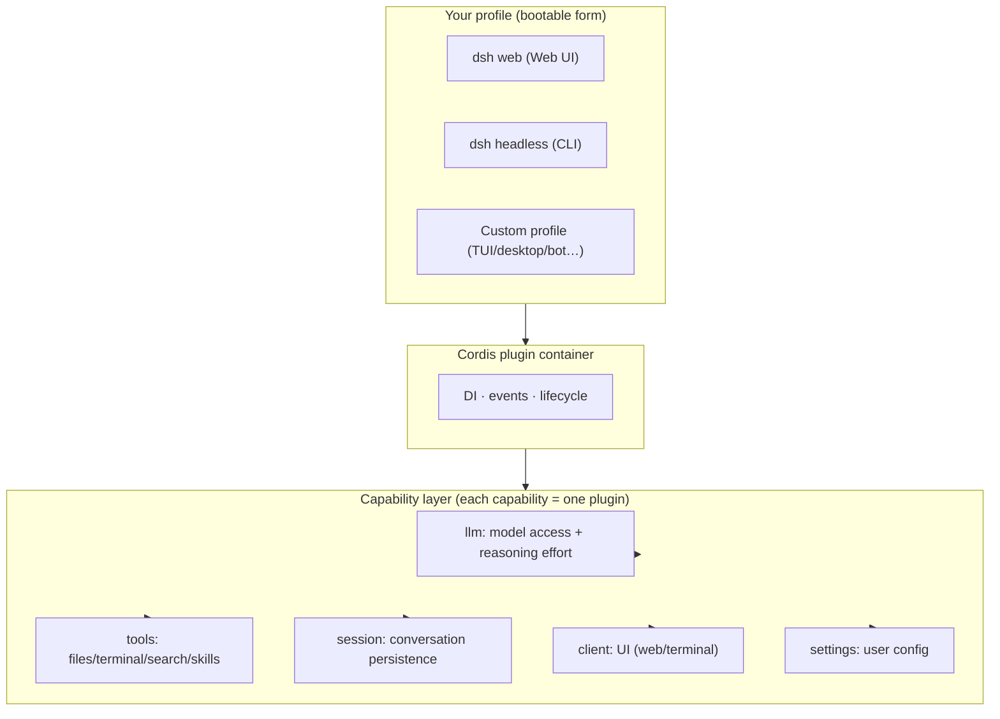

# Chapter 1: Understanding DeepSeek Harness

> Goal: build a complete mental model of DeepSeek Harness (dsh) from absolute zero — **what it is, why it matters, how it differs from mainstream agents, and when to use it**. No prior knowledge required.

## 1.1 Three intuitions first

**① What is dsh? — "the LEGO baseplate for agents."**
LEGO gives you the baseplate and standard bricks (runtime + core plugins); you assemble freely (add plugins, swap UIs, change behavior). Claude Code, by contrast, is "a finished car" — great to drive, but modifying the engine means asking the vendor.

**② Why "harness"? — the engineering layer around a model.**
A model (DeepSeek V4) only "replies with text." To make it work in your repository (read files, run commands, edit code, loop), you need an engineering layer on top: session management, tool calling, context control, error recovery. **That layer is a harness.** dsh is DeepSeek open-sourcing that layer.

**③ Why open-source it now? — agents entered the "programmable era".**
2025 was model-capability competition; 2026 is agent-engineering competition. Open-sourcing the harness is the strategic move to make "how to organize agents" an open ecosystem — like Android did for phones.

## 1.2 Official facts

**One-liner**: DeepSeek Harness (`dsh`) is DeepSeek's open-source agent runtime with an "everything is a plugin" architecture, built on the Cordis plugin container.

| Fact | Value |
|---|---|
| Open-sourced | 2026-08-13 |
| License | MIT |
| Language | TypeScript (Node.js ≥ 22) |
| Version | `0.1.0-rc.x` (rc.8; fast iteration, breaking changes expected) |
| Runtime | Cordis |
| Built-in profiles | `web` + `headless` |

## 1.3 How "everything is a plugin" works



### Layered view

```
┌──────────────────────────────────────────────┐
│  Your profile (bootable form)                │
│  = bundle stack + your patch layer           │
│  · dsh web (Web UI)                          │
│  · dsh headless (CLI)                        │
│  · your custom profile (TUI/desktop/bot…)    │
├──────────────────────────────────────────────┤
│  Capability layer (each = a plugin)          │
│  · llm · tools · session · client · settings │
│  … (60+ official packages)                   │
├──────────────────────────────────────────────┤
│  Cordis container: loading, DI, events, lifecycle │
└──────────────────────────────────────────────┘
```

### Three concepts you must know

**① Profile (bootable form)** — a directory `$DSH_HOME/profiles/<name>/` with `package.json` (plugin deps + manifest) and `cordis.patch.yml` (your patch layer). Load order: built-in bundles → profile patch → global patch → `--patch` overlays.

**② host half / client half** — one npm package can carry both: the host half (`apply(ctx)` on Node: tools, services, events) and the client half (browser UI, declared via `dsh.client` in package.json).

**③ Extension points** — official principle: *"Plugins, not loop changes."* Use hooks, don't fork the core. Common ones: `agent/request` waterfall (change request config per step), `conversationEvents.register`, `ctx.slots.inject` (inject UI), `settings` service.

## 1.4 dsh vs mainstream agents

### Capability matrix

| Dimension | **dsh** | Claude Code | OpenAI Codex | OpenCode | Gemini CLI | Kimi CLI |
|---|---|---|---|---|---|---|
| Open source | ✅ MIT | ❌ | ✅ Apache-2.0 (CLI/harness) | ✅ MIT | ❌ | ❌ |
| Model binding | model-agnostic | Claude | GPT | any | Gemini | Kimi |
| Official runtime | ✅ + plugin ecosystem | product | product | client only | product | product |
| **Plugin system** | **first-class, 60+ official pkgs** | config/hooks | config | config | none | none |
| Custom UI | ✅ (client half) | ❌ | ❌ | partial | ❌ | ❌ |
| Automation/CI | ✅ headless | ✅ | ✅ | ✅ | ✅ | ✅ |
| TUI | plugin-provided | ✅ built-in | ✅ built-in | ✅ built-in | ✅ | ✅ |
| Ecosystem stage | day-zero (2026-08-13) | mature | mature | mature | mature | early |
| Best for | **deep customization + ecosystem** | out-of-box | out-of-box | OpenCode users | Google | Kimi |

### Case: same task, different doors

**Task**: "Find every call of function X in the repo and change one argument."

| Agent | How you do it |
|---|---|
| dsh (web) | `dsh web` → type → model uses Grep/Read/Edit tools; add plugin sidebars (Git panel, speed-up plugin) |
| dsh (headless) | `dsh --profile headless "task"` → prints result, exits — **CI-friendly** |
| Claude Code / Codex / OpenCode / Kimi | open the TUI → type → model does it |

**The difference**: same sentence, but dsh gives you a choice dimension — swap the UI and toolchain. Others ship a fixed interface.

### Case: real workloads (our measurements, 2026-08-13)

| Scenario | dsh measured | Note |
|---|---|---|
| Simple file create | cold start ~110s (first round, context injection) → hot cache ~1s | reasoning effort is the main variable |
| 50-step tool chain | LLM 10m+, tool calls 9m+ | per-step thinking accumulates — **that's the speed plugin's value** |
| Plugin dev | zero to runnable plugin: 1 day (tests + live verify) | clear extension points |
| vs Claude Code same task | dsh + V4-Flash ≈ 1/10–1/30 of Claude cost | price dimension favors dsh ecosystem |

## 1.5 When to use dsh

**✅ Adopt now**: model-agnostic + UI-optional + behavior-mutable base; be an early ecosystem contributor; run agents on servers/CI; cost-sensitive.

**⏸ Wait**: you need an out-of-the-box coding assistant; can't accept rc breaking changes; deeply dependent on a vendor's exclusive model feature.

## 1.6 FAQ

- **Is dsh a model?** No. It's a runtime; models plug in via the `llm` plugin (DeepSeek V4 native, OpenAI-compatible others possible).
- **dsh vs OpenCode?** Both open-source agent clients; OpenCode is "client + config", dsh is "runtime + official plugin ecosystem" (official bundles, 60+ packages).
- **Do I need TypeScript?** To *use* it, no. To *write plugins* (Ch.4), basic TS — with full code in the handbook.
- **Is it stable?** rc stage; use for ecosystem/tinkering now, production core after 0.1.0.
- **Why learn dsh now?** Day-zero ecosystem + official encouragement + Chinese-tutorial vacuum — first-mover window.

---

**Next**: [Chapter 2: 5-Minute Quickstart](./02-quickstart.md)
