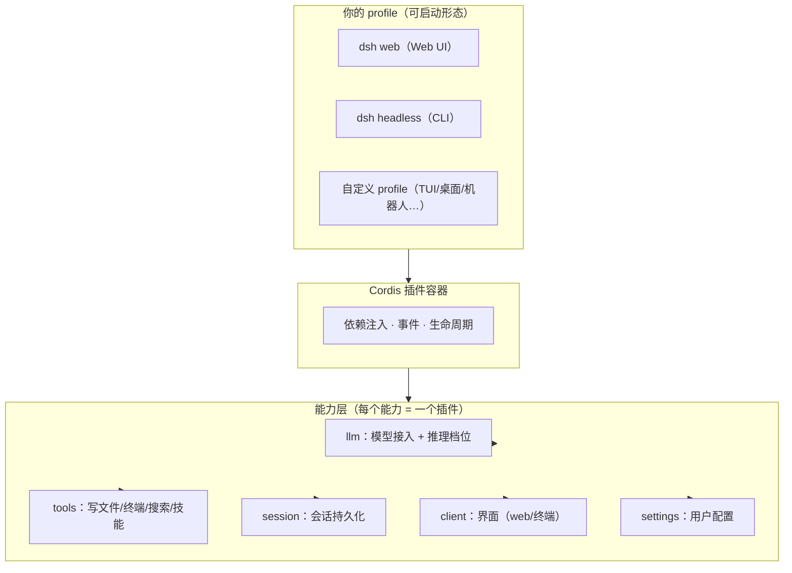

# 第 1 章：认识 DeepSeek Harness

> 本章目标：从一个完全零基础的角度，建立对 DeepSeek Harness（dsh）的完整认知——**它是什么、为什么值得学、和主流 Agent 有什么区别、什么时候用它**。读完本章，你不需要任何前置知识，就能理解 dsh 在整个 AI 开发工具版图中的位置。

## TL;DR（本章核心，30 秒版）

1. **dsh = Agent 的乐高底座**：官方开源（MIT）的运行时，一切能力都是插件，你可以自由拼装
2. **harness = 模型外面的工程层**：会话、工具、上下文、循环控制——让模型在仓库里真正干活
3. **和 Claude Code 的区别**：Claude Code 是"整车"，dsh 是"底座 + 积木"——可定制面完全不同
4. **生态窗口**：2026-08-13 开源，中文教程此前为零——现在入场是早期
5. **谁该用**：要深度定制/玩生态/跑 CI 的开发者；要开箱即用的选 Claude Code

<!-- [fix] 结构核验：补齐本章导航（第 1 章原缺失，与第 3-11 章结构保持一致） -->
<details><summary>本章导航</summary>
- [1.1 先建立三个直觉](#11-先建立三个直觉)
- [1.2 官方定义与核心事实](#12-官方定义与核心事实)
- [1.3 架构是怎么"一切皆插件"的](#13-架构是怎么一切皆插件的)
- [1.4 DSH 与主流 Agent 的全面对比](#14-dsh-与主流-agent-的全面对比)
- [1.5 什么时候用 dsh（选型决策）](#15-什么时候用-dsh选型决策)
- [1.6 常见问题（FAQ）](#16-常见问题faq)
</details>

## 1.1 先建立三个直觉

在讲技术之前，先用三个类比建立直觉：

**① dsh 是什么？——它是"Agent 的乐高底座"。**
想象乐高：官方提供底板和标准积木（运行时 + 核心插件），你可以自由拼装（加插件、换界面、改行为）。对比之下，Claude Code 更像"一辆整车"——很好开，但你想改装发动机得找官方。

**② 为什么需要"harness"这个词？——它是"套在模型外面的工程层"。**
一个模型（DeepSeek V4）本身只会"回复文字"。要让它在你的代码仓库里干活（读文件、跑命令、改代码、多轮循环），外面需要一层工程：会话管理、工具调用、上下文控制、错误恢复。**这层工程就叫 harness**。dsh 是 DeepSeek 官方把这层工程开源出来的产品。

**③ 为什么 2026 年才开源？——因为 Agent 进入"可编程时代"。**
2025 年是"模型能力竞赛"（谁能生成更好的代码）；2026 年进入"Agent 工程竞赛"（谁能更好地组织模型干活）。DeepSeek 开源 harness 的战略意图：**把"如何组织 Agent"这件事变成开放生态**——像当年 Android 开源改变手机生态一样。

## 1.2 官方定义与核心事实

**一句话定义**：DeepSeek Harness（`dsh`）是 DeepSeek 官方开源的 Agent 运行时，采用"一切皆插件"（everything is a plugin）架构，基于 Cordis 插件容器构建。

| 事实 | 内容 |
|---|---|
| 开源时间 | 2026-08-13 |
| 协议 | MIT（可商用、可改） |
| 语言 | TypeScript（Node.js ≥ 22） |
| 版本线 | `0.1.0-rc.x`（当前 rc.8，迭代快，官方明示"将有破坏性变更"） |
| 底层 | [Cordis](https://github.com/cordiverse/cordis)（可组合插件容器） |
| 内置形态 | `web`（Web UI）+ `headless`（一次性 CLI） |
| 官方定位 | 官方 README 原话："everything is a plugin" |

## 1.3 架构是怎么"一切皆插件"的



<!-- [style] 子标题统一不带编号（原 3.1/3.2 为旧章节号残留，对齐其余章节） -->
### 分层视图

```text
┌──────────────────────────────────────────────┐
│  你的 profile（可启动形态）                    │
│  = bundle 栈 + 你的补丁层                      │
│  · dsh web（Web UI 形态）                     │
│  · dsh headless（CLI 形态）                   │
│  · 你的自定义 profile（TUI/桌面/机器人…）      │
├──────────────────────────────────────────────┤
│  能力层（每个能力 = 一个插件）                 │
│  · llm：模型接入（DeepSeek V4 系 + 推理档位）   │
│  · tools：工具（写文件/终端/搜索/技能…）        │
│  · session：会话持久化                        │
│  · client：界面（web 浏览器半 / 终端半）        │
│  · settings：用户配置                         │
│  …（60+ 官方包）                              │
├──────────────────────────────────────────────┤
│  Cordis 插件容器：加载、依赖注入、事件、生命周期 │
└──────────────────────────────────────────────┘
```

<!-- [style] 子标题编号统一：去掉残留旧编号 -->
### 三个必须懂的概念

**① profile（可启动形态）**
一个 profile = `$DSH_HOME/profiles/<name>/` 目录，包含：
- `package.json`：插件依赖 + 清单（`dsh.profile.bundles` 指定 bundle 顺序）
- `cordis.patch.yml`：你的补丁层（挂载/覆盖插件）
启动时按顺序合成：内置 bundle → profile patch → 全局 patch → `--patch` 覆盖。

**② host 半 / client 半（一个插件，两副面孔）**
| 半边 | 跑在哪 | 干什么 |
|---|---|---|
| host 半 | Node 进程 | 工具、服务、事件、文件系统——`apply(ctx)` 注册 |
| client 半 | 浏览器（web profile） | UI、交互——`package.json` 的 `dsh.client` 声明 |

一个 npm 包可同时携带两半（`exports["."]` + `exports["./client"]`）。

**③ 扩展点（extension point）**
官方原则："**Plugins, not loop changes**"——改行为优先用官方钩子，不要 fork 核心。常用扩展点（后续章节逐一实战）：
- `agent/request` waterfall：每次模型请求前改配置（工具调用提速插件的挂点）
- `conversationEvents.register`：订阅/注入对话事件
- `ctx.slots.inject`：在界面槽位注入 UI
- `settings` 服务：注册用户可配置项

## 1.4 DSH 与主流 Agent 的全面对比

<!-- [style] 子标题编号统一：去掉残留旧编号 -->
### 能力矩阵（核心六家）

| 维度 | **dsh** | Claude Code | OpenAI Codex | OpenCode | Gemini CLI | Kimi CLI |
|---|---|---|---|---|---|---|
| 开源 | ✅ MIT | ❌ 闭源 | ✅ Apache-2.0（CLI/harness） | ✅ MIT | ❌ 闭源 | ❌ 闭源 |
| 模型绑定 | 模型无关（官方适配 DeepSeek） | Claude 系 | GPT 系 | 任意 | Gemini 系 | Kimi 系 |
| 官方运行时 | ✅（web + headless + 插件生态） | 产品即运行时 | 产品即运行时 | 客户端（无官方后端） | 产品即运行时 | 产品即运行时 |
| **插件体系** | **官方级：一切皆插件，60+ 官方包** | 配置/钩子为主 | 配置为主 | 配置为主 | 无 | 无 |
| 自定义界面 | ✅（client 半 = 自由 UI） | ❌ | ❌ | 部分（TUI 固定） | ❌ | ❌ |
| 自动化/CI | ✅ headless profile | ✅ | ✅ | ✅ | ✅ | ✅ |
| TUI | 插件可做（官方未内置） | ✅ 内置 | ✅ 内置 | ✅ 内置 | ✅ | ✅ |
| 生态阶段 | 零日起步（2026-08-13） | 成熟 | 成熟 | 成熟 | 成熟 | 早期 |
| 适合谁 | **想深度定制 + 玩生态的开发者** | 开箱即用 | 开箱即用 | 熟悉 OpenCode 用户 | Google 生态 | Kimi 生态 |

<!-- [style] 子标题编号统一：去掉残留旧编号 -->
### 更多主流 Agent 速览（一句话定位）

| Agent | 一句话定位 | 与 dsh 的核心差异 |
|---|---|---|
| **Cursor** | IDE 内嵌的 AI 编码助手（Composer/Agent 模式） | 深度绑定 IDE；dsh 是独立运行时，可配任意编辑器/终端 |
| **Amp** | 终端原生、代理优先的 AI 编码 agent | 轻量终端形态；dsh 多了官方后端 + 插件生态 |
| **Devin** | 云端"AI 软件工程师"（独立任务/浏览器/工作区） | 托管云端；dsh 本地运行、数据不出本机 |
| **Windsurf** | IDE 内嵌编码 agent（Flow/Agent 模式） | 同 Cursor，绑定 IDE |
| **Aider** | 开源、Git 优先的终端 pair-programming agent | 专注"改代码 + git"；dsh 是通用运行时 |
| **Qwen Code** | 阿里通义 coding agent CLI（内置 DeepSeek provider） | 主打 Qwen 模型；dsh 官方适配 DeepSeek 且插件化 |
| **GLM CLI** | 智谱 coding agent CLI | 主打 GLM 模型；dsh 模型无关 + 插件生态 |
| **Grok CLI** | xAI 终端 coding agent | 主打 Grok 模型 |

> 结论：主流 agent 大致分三类——**IDE 内嵌**（Cursor/Windsurf）、**终端编码助手**（OpenCode/Aider/Qwen Code/GLM CLI/Grok CLI）、**运行时/平台**（dsh/Devin/**Codex harness**）。dsh 与 Codex harness 同为开源运行时，其中 **dsh 独有“官方开源 + 模型无关 + 一切皆插件”** 的组合（Codex 仍以 OpenAI 模型为核心）。

<!-- [style] 子标题编号统一：去掉残留旧编号 -->
### 通俗文字版：每家是什么、适合谁、和 dsh 差在哪

**Claude Code（Anthropic）**：目前最成熟的终端编码助手。开箱即用、TUI 体验好、生态成熟——**适合想马上干活的人**。缺点：闭源、绑定 Claude 模型、定制空间有限（只能配置/钩子）。和 dsh 比：dsh 能改的东西它改不了（界面/工具链/后端），但 dsh 的"开箱即用"还比不上它。

**OpenAI Codex**：OpenAI 的终端 agent，**其 harness 早已开源**——[openai/codex](https://github.com/openai/codex) 自 2025-04 建仓起即为 Apache-2.0 公开仓库（Rust 重写，含 SDK 与 app-server）。工程能力强、GPT 系模型加持。**注意开源边界**：开源的是 harness 层（CLI/SDK/app-server），模型（GPT 系）与云端 Codex 产品仍闭源。和 dsh 比：两者已同为开源运行时，核心差异在 **插件体系**—— dsh “一切皆插件”（60+ 官方包，host/client 双半可深度定制），Codex 则以终端编码助手形态为主。

**OpenCode**：开源、终端、可配任意模型——和 dsh 最像的"邻居"。关键差异：**OpenCode 没有官方后端运行时**（它是客户端 + 配置），dsh 有官方 bundle + 60+ 包 + 插件生态，可定制面更深。**如果你是 OpenCode 用户，迁移 dsh 的成本很低**（概念类似）。

**Gemini CLI**：Google 的终端 agent。长上下文/多模态是强项（Gemini 模型优势）。绑定 Google 生态。

**Kimi CLI**：月之暗面的终端 agent。中文场景好、Kimi 模型加持。生态早期。

**Cursor / Windsurf**：IDE 内嵌型——它们的优势是"编辑器里就用"，劣势是**你被锁在 IDE 里**。dsh 是独立运行时，可以在任意环境（终端/CI/服务器/未来的 TUI）用同一套 agent 能力。

**Devin**：云端工程师——你给它任务，它在云上干活。优势是托管、有浏览器；劣势是**数据出本机**、费用高。dsh 本地运行，隐私可控。

**Aider**：老牌开源、Git 优先、轻量。适合"只想让 AI 帮改代码"的极简主义者。dsh 是更重的运行时——如果你只需要 Aider 做的事，Aider 够用；如果你想做 Agent 系统，dsh 是底座。

**Qwen Code / GLM CLI / Grok CLI**：各家模型的终端 agent——模型绑定是它们的天然属性。dsh 模型无关（官方适配 DeepSeek，可接 OpenAI 兼容），更适合想"模型可换"的人。

<!-- [style] 子标题编号统一：去掉残留旧编号 -->
### 一张图理解 dsh 的差异化位置

```text
定制深度（可改的东西）
   高 │            dsh（运行时 + 插件生态）
      │
      │    自建框架（LangGraph 等）
      │
      │    OpenCode（客户端 + 配置）
      │
   低 │    Claude Code / Codex / Gemini / Kimi（产品即运行时）
      └──────────────────────────────────────
       低            开箱即用程度            高
```

- **右上**：dsh——可定制面最大，但"开箱即用"需生态补足
- **左上**：自建框架——完全自由但全要自己搭
- **右下**：产品型 agent——最好用但最封闭

<!-- [style] 子标题编号统一：去掉残留旧编号 -->
### 案例对比：同一个任务，不同的打开方式

**任务**：让 Agent 在仓库里"找到所有调用某个函数的地方，并统一改一个参数"。

| Agent | 你会怎么做 | 体验 |
|---|---|---|
| **dsh（web）** | `dsh web` → 输入指令 → 模型用 Grep/Read/Edit 工具完成 | Web UI + 右侧插件侧边栏（可加 Git 面板） |
| **dsh（headless）** | `dsh --profile headless "任务"` → 打印结果退出 | **可进 CI**：非零退出码即失败 |
| Claude Code / Codex / OpenCode / Kimi | 打开 TUI → 输入指令 → 模型完成 | 终端 TUI，开箱即用 |
| Cursor / Windsurf | 在 IDE 里选中代码 → 输入指令 | IDE 内嵌体验 |
| Devin | 网页里建任务 → 云上完成 | 托管、有浏览器、数据出本机 |

**差异点在哪**：同样一句话，**dsh 让你多了一个选择维度——界面和工具链都可以换**。其他 Agent 的界面/工具链是官方定的，dsh 是你可以拼的。

<!-- [style] 子标题编号统一：去掉残留旧编号 -->
### 案例对比：真实工作流（我们的实测）

以下是我们**真实开发 dsh 生态**时的对比观察（2026-08-13）：

| 场景 | dsh 实测 | 备注 |
|---|---|---|
| 简单文件创建 | 冷启动 ~110s（首轮含上下文注入）→ 热缓存 ~1s | 思考档位是主要变量 |
| 50 步工具链任务 | LLM 耗时 10m+，工具调用 9m+ | 每步思考累计——**提速插件价值在此** |
| 插件开发 | 从零到可运行插件：1 天（含测试+实机验证） | 扩展点清晰（agent/request waterfall） |
| 与 Claude Code 同任务 | dsh 配 V4-Flash 成本约为 Claude 的 1/10~1/30 | 价格维度 dsh 生态显著占优 |

> 同模型 × 不同 Agent 的严格对比见 [Benchmark 附录](./benchmark.md)（omp 36s / dsh 85s / opencode 114s）。

## 1.5 什么时候用 dsh（选型决策）

**✅ 推荐入场**：
- 你要做**模型无关、界面可选、行为可改**的 Agent 底座
- 你想成为 **dsh 生态早期贡献者**（先发优势，官方点名鼓励）
- 你要在**服务器/CI** 跑 Agent（headless profile）
- 你对**成本敏感**（DeepSeek 模型 + 开源生态）

**⏸ 暂时观望**：
- 只要"开箱即用的编码助手"——Claude Code 等更成熟
- 不能接受 rc 阶段的破坏性变更——等 `0.1.0` 正式版
- 重度依赖某模型独有能力（如 Claude artifacts）——模型绑定场景

## 1.6 常见问题（FAQ）

**Q1：dsh 是模型吗？**
不是。dsh 是运行时/框架，模型通过 `llm` 插件接入（官方适配 DeepSeek V4 系，理论上可接其他 OpenAI 兼容模型）。

**Q2：dsh 和 OpenCode 什么关系？**
都是开源 Agent 客户端，但定位不同：OpenCode 是"客户端 + 配置"，dsh 是"运行时 + 官方插件生态"（有官方后端 bundle 与 60+ 官方包）。dsh 更底层、可定制面更大。

**Q3：没写过 TypeScript 能玩吗？**
能。使用（第 2 章）不需要编程；写插件（第 4 章）需要基础 TS，但教程给完整代码。

**Q4：dsh 稳定吗？**
当前 rc 阶段（0.1.0-rc.8），迭代快、有破坏性变更。生产核心依赖建议等正式版；玩生态现在正是时机。

**Q5：为什么现在学 dsh 值得？**
生态零日 + 官方点名鼓励社区 + 中文教程空白——**每个早期生态都有"第一个吃螃蟹的人"的红利**，现在是入场窗口。

---

**下一章**：[第 2 章：五分钟快速上手](./02-quickstart.md) —— 装起来，跑起来。

---

## 动手练习（检验你是否真懂了）

1. **一句话测试**：向不懂技术的人解释"dsh 是什么"（不能用"Agent/harness/插件"这些词）
2. **对比测试**：说出 dsh 和 Claude Code 的 3 个本质区别（不是功能列表）
3. **选型测试**：给下面场景选工具并说明理由：
   - 场景 A：想要开箱即用的终端编码助手
   - 场景 B：想做一个"模型无关、界面自定义"的公司内部 Agent 平台
   - 场景 C：想在 CI 里每天自动跑一个数据分析任务
4. **架构测试**：画出"profile → 插件 → 扩展点"的关系图（不看原文）
5. **FAQ 测试**：回答"dsh 是模型吗？""没写过 TS 能玩吗？"

> 完成练习后，进 [第 2 章](./02-quickstart.md) 动手装起来。
